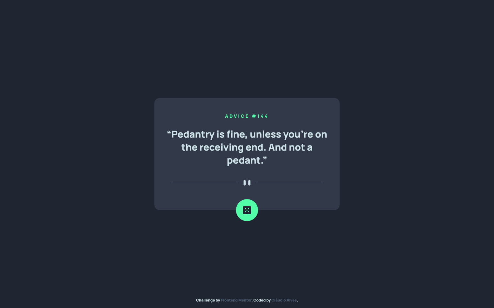
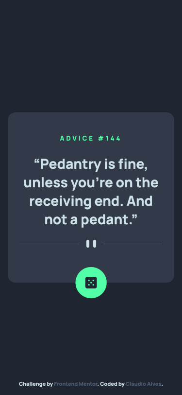

# Frontend Mentor - Advice generator app solution

Hello, World!! <br>
Thank you for checking my [Solution](https://www.frontendmentor.io/solutions/advice-generator-app-w-scss-and-javascript-ti96cjPF4l) to the [Advice generator app challenge on Frontend Mentor](https://www.frontendmentor.io/challenges/advice-generator-app-QdUG-13db). Frontend Mentor challenges help you improve your coding skills by building realistic projects.

## Table of contents

- [Overview](#overview)
  - [The challenge](#the-challenge)
  - [Screenshot](#screenshot)
  - [Links](#links)
- [My process](#my-process)
  - [Built with](#built-with)
  - [What I learned](#what-i-learned)
  - [Continued development](#continued-development)
- [Author](#author)

## Overview

### The challenge

Users should be able to:

- View the optimal layout for the app depending on their device's screen size
- See hover states for all interactive elements on the page
- Generate a new piece of advice by clicking the dice icon

### Screenshot





### Links

- [Solution](https://www.frontendmentor.io/solutions/advice-generator-app-w-scss-and-javascript-ti96cjPF4l)
- [DEMO](https://claudioalvesmachado.github.io/advice-generator-app/)

## My process

### Built with

- HTML5
- SASS/SCSS
- Flexbox
- Mobile-first workflow
- Javascript

### What I learned

Well, it's the first time I use an API, so I learned how consume them using ``` fetch() ```.

### Continued development

For sure I want to develop more projects consuming APIs and, of course, learn how to create my own.

## Author

- Frontend Mentor - [@claudioalvesmachado](https://www.frontendmentor.io/profile/claudioalvesmachado)
- Linkedin - [Cláudio Alves](https://www.linkedin.com/in/mlvgns/)